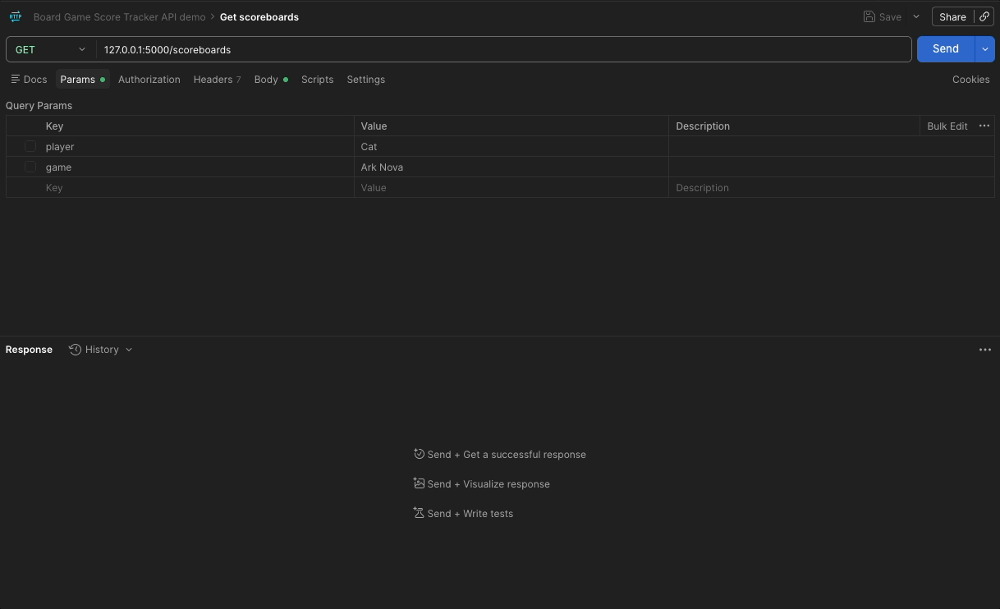
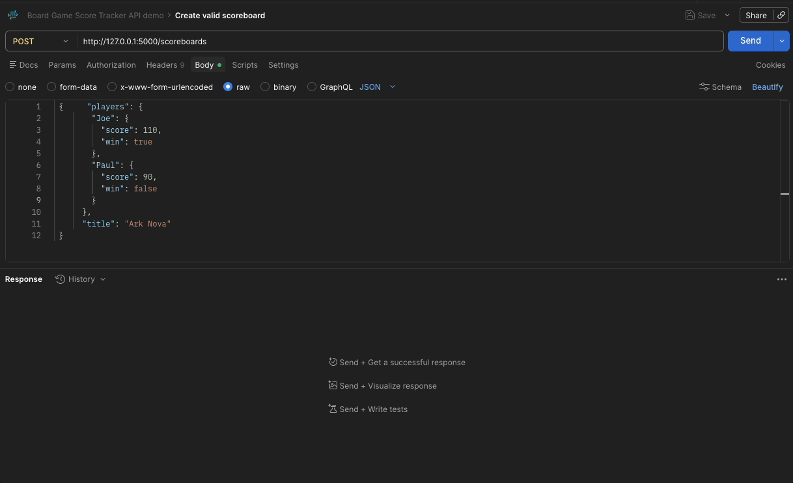
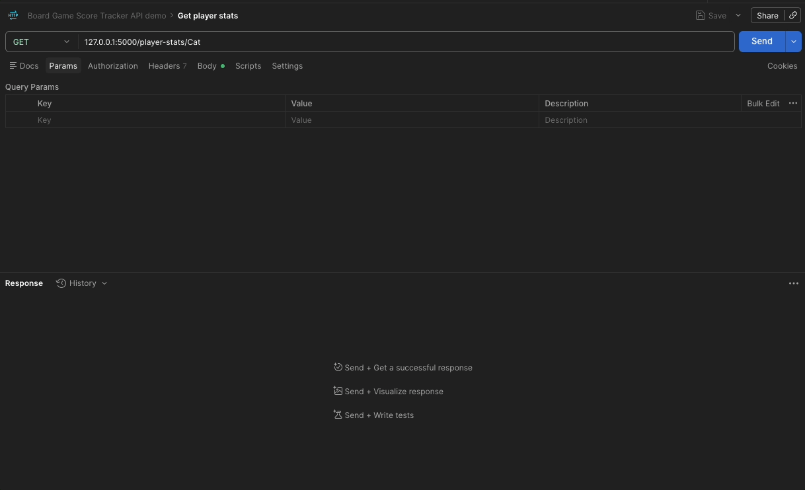
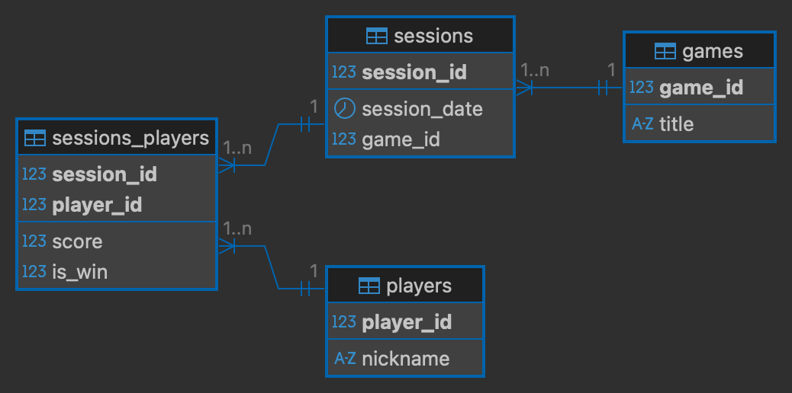

# Board Game Score Tracker API

## Features
*  Web API (Flask) records scoreboards for board games using a MySQL database including data on:
    * Board game name
    * Players involved
    * Score and win info for each player
* Supported endpoints for the API are summarised on home page route through HTML script and in the API reference, see [below](#api-reference)
* API endpoints are tested using the `unittest` module, see [testing](#testing)
* User-Interface serviced with a Python console application including functionality for:
  * Retrieving all scoreboards from the API (GET request)
  * Retrieving scoreboards filtered by optional combination of game title and participating player name (GET request with query params)
  * Recording a new scoreboard (POST request)
  * Retrieving statistics on number of games won, number of games played and highscores for each game by player name (GET request)

## Demos
The following demos are included to demonstrate both the behaviour of the console application client to the API and the behaviour of the API endpoints receiving requests directly using Postman.

### Python console application (main.py)


### API endpoints
```http
  GET /scoreboards
```


```http
  POST /scoreboards
```


```http
  GET /player-stats
```



## API reference

### Retrieve all recorded scoreboards 

```http
  GET /scoreboards
```
| Query Parameters | Type     | Description                       |
| :-------- | :------- | :-------------------------------- |
| `game`      | `string` | **Optional**. Key term to filter results by game tilte  |
| `player`      | `string` | **Optional**. Key term to filter results by participating player name  |


**EXAMPLE OUTPUT**:
```json
{
    "data": [
        {
            "date": "Mon, 14 Sep 2026",
            "id": 26,
            "players": {
                "Cat": {
                    "score": 92,
                    "win": false
                },
                "Joe": {
                    "score": 130,
                    "win": true
                }
            },
            "title": "Ark Nova"
        },
        {
            "date": "Mon, 14 Sep 2026",
            "id": 25,
            "players": {
                "Cat": {
                    "score": 110,
                    "win": true
                },
                "Joe": {
                    "score": 90,
                    "win": false
                }
            },
            "title": "Ark Nova"
        },
        {
            "date": "Fri, 11 Sep 2026",
            "id": 2,
            "players": {
                "Cat": {
                    "score": 239,
                    "win": true
                },
                "Paul": {
                    "score": 162,
                    "win": false
                }
            },
            "title": "Forest Shuffle"
        },
        {
            "date": "Fri, 11 Sep 2026",
            "id": 4,
            "players": {
                "Cat": {
                    "score": 129,
                    "win": true
                },
                "Paul": {
                    "score": 113,
                    "win": false
                }
            },
            "title": "Terraforming Mars"
        }
    ],
    "message": "Retrieved 4 scoreboards for {'game': all, 'player': 'cat'}.",
    "status": "success"
}
```

| Field      | Type   |  Description                           |
| ---------- | ------- | ----------------------------------    |
| `date` | `datetime.date` | Date of the session | 
| `id`    | `int`   | Unique scoreboard ID (1:1 with session id in db) |
| `players` | `dict`  | Summary of score, and win information keyed by player nickname |
| `score` | `int`  | Score for player key in `players` |
| `win` | `bool`  | Whether that player won the game for player key in `players` |
| `title` | `string`  | Title of the board game. |


### Record new scoreboard

```http
  POST /scoreboards
```

**EXAMPLE POST REQUEST:** 

`base_url =  DB_HOST:DB_PORT`
```bash
curl -X POST {base_url}/scoreboards \
-H "Content-Type: application/json" \
-d '{"title": "Ark Nova", "players": {"Cat": {"win": false, "score": 92}, "Joe": {"win": true, "score": 130}}}'
```

**EXAMPLE OUTPUT:**
```json
{
    "data": {
        "date": "Mon, 14 Sep 2026",
        "id": 26,
        "players": {
            "Cat": {
                "score": 92,
                "win": false
            },
            "Joe": {
                "score": 130,
                "win": true
            }
        },
        "title": "Ark Nova"
    },
    "message": "New scoreboard created with ID 26.",
    "status": "success"
}
```

### Retrieve player stats by player name

```http
  GET /player-stats/:player_name
```

**EXAMPLE OUTPUT**:
```json
{
    "data": {
        "game_highscores": [
            {
                "high_score": 110,
                "title": "Ark Nova"
            },
            {
                "high_score": 239,
                "title": "Forest Shuffle"
            },
            {
                "high_score": 129,
                "title": "Terraforming Mars"
            }
        ],
        "total_games": 4,
        "total_wins": 3
    },
    "message": "Retrieved stats for Cat.",
    "status": "success"
}
```

| Field      | Type   |  Description                           |
| ---------- | ------- | ----------------------------------    |
| `games_highscores`    | `list`   | List of highscore information per game |
| `title` | `str` | Title (name) of the game | 
| `high_score` | `int` | Highest score recorded for the game (title) across all recorded scoreboards | 
| `total_games` | `int`  | Total number of games played across all recorded scoreboards |
| `total_wins` | `int`  | Total number of games won across all recorded scoreboards |


## Database information

The application is supported by a MySQL database. The database is initialised at the startup of the API (including the creation of the database and required tables) using the `db_init` method defined in `db.py`.

### Database schema


## Setup information
### Dependencies
* Local python installation - tested on `Python 3.12.2`
* Terminal application
* MySQL RDBMS

### Environment Variables

To run this project, you will need to add the following environment variables to your .env file:

#### Database configuration
* `DB_HOST` - Server host for MySQL
* `DB_PORT` - Port number for MySQL server
* `DB_USER` - MySQL username
* `DB_PWD` - MySQL password

#### API server setup
* `API_HOST` - Host for API application
* `API_PORT` - Port for API application

An example format is provided in `env.example`. These example values can be edited and copied into a `.env`file.

### How to run

A python virtual environment is used for ease of setup. The environment for this repo can be set up as follows: 
```
python -m venv myenv 
source myenv/bin/activate
pip install -r requirements.txt
```

The API can be set up and ran as follows:
```
python run_api.py
```
Then in a separate terminal run the user interface (provided by a python console application):
```
python run_client.py
``` 

### Testing
Tests are provided for the API routes in `tests/test_api.py`. Tests can be ran as follows:
```
python -m unittest discover -s tests -v
```

### File formatting

The *.py files included in this repo are formatted and linted using [black](https://black.readthedocs.io/en/stable/index.html#) and [ruff](https://docs.astral.sh/ruff/) respectively. (This is done using the dedicated VSCode extensions, respective versions are noted in `.pre-commit-config.yaml`)

To preserve the format of any code committed to this repository pre-commit hooks for the file formatting are included and managed by the [`pre-commit`](https://pre-commit.com/) library (pip-installable and included in `requirements.txt`). Before developing on this repo run `pre-commit install` to set up the git hook scripts. The file formatting is now checked (and fixed) at each commit. 
